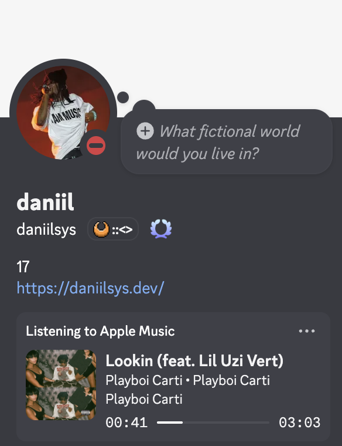

<div align="center">

# Apple Music RPC

**Show what you're listening to on Discord — natively, from macOS.**


A lightweight Rust daemon that displays your current Apple Music track as a Discord Rich Presence - with album artwork, progress bar, and artist info.

No Electron. No heavy SDK. Just AppleScript + Discord IPC.



</div>

---

## Features

- **Track info** — song title, artist, and album displayed on your Discord profile
- **Album artwork** — cover art fetched automatically via Deezer API
- **Progress bar** — shows elapsed and remaining time
- **Smart updates** — only updates Discord when the track or playback state changes
- **Auto-reconnect** — reconnects automatically if Discord restarts
- **Proxy support** — works behind HTTP proxies (env vars or macOS system proxy)
- **LaunchAgent ready** — can run as a background service that starts at login
- **Tiny footprint** — ~1.4 MB binary, ~3.5 MB RAM

## Requirements

- macOS
- Apple Music (Music.app)
- Discord desktop app
- Rust toolchain (via [`rustup`](https://rustup.rs))

## Installation

```bash
git clone https://github.com/daniilsys/apple-music-rpc.git
cd apple-music-rpc
cargo build --release
```

The binary will be at `target/release/apple-music-rpc`.

### Run manually

```bash
./target/release/apple-music-rpc
```

### Run as a background service (LaunchAgent)

1. Copy the binary somewhere persistent:

```bash
cp target/release/apple-music-rpc ~/.local/bin/
```

2. Create `~/Library/LaunchAgents/com.applemusicrpc.plist`:

```xml
<?xml version="1.0" encoding="UTF-8"?>
<!DOCTYPE plist PUBLIC "-//Apple//DTD PLIST 1.0//EN"
  "http://www.apple.com/DTDs/PropertyList-1.0.dtd">
<plist version="1.0">
  <dict>
    <key>Label</key>
    <string>com.applemusicrpc</string>

    <key>ProgramArguments</key>
    <array>
      <string>/Users/YOUR_USERNAME/.local/bin/apple-music-rpc</string>
    </array>

    <key>RunAtLoad</key>
    <true/>

    <key>KeepAlive</key>
    <true/>
  </dict>
</plist>
```

3. Load the service:

```bash
launchctl bootstrap gui/$(id -u) ~/Library/LaunchAgents/com.applemusicrpc.plist
```

To stop it:

```bash
launchctl bootout gui/$(id -u) ~/Library/LaunchAgents/com.applemusicrpc.plist
```

## Proxy

If you're behind an HTTP proxy, set the environment variable before running:

```bash
export HTTPS_PROXY=http://proxy-host:port
./target/release/apple-music-rpc
```

The app will first try a direct connection, then fall back to the proxy if needed. It also reads the macOS system proxy configuration automatically via `scutil --proxy`.

## How it works

1. Polls Apple Music every 3 seconds via AppleScript
2. Fetches album artwork from the Deezer API
3. Sends Rich Presence updates to Discord over its local IPC socket

## License

Made with ❤️ by daniilsys

[MIT](LICENSE)
